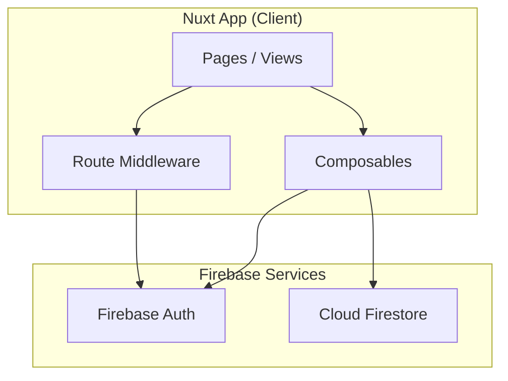

# Design Document: Appointment Scheduling

## Overview

Sistema de agendamiento de citas médicas construido con Nuxt 4, Firebase Auth y Firestore. Utiliza el módulo `nuxt-vuefire` para integración nativa con Firebase. La secretaria es el rol central que registra pacientes y agenda citas. Doctores y pacientes pueden visualizar sus citas respectivas.

### Decisiones de diseño clave

- **nuxt-vuefire**: Módulo oficial que provee composables auto-importados (`useCurrentUser`, `useCollection`, `useDocument`, `useFirestore`) y manejo de auth con `getCurrentUser()` para middleware
- **Firebase Auth**: Autenticación con email/password. La secretaria crea cuentas de pacientes usando `createUserWithEmailAndPassword` desde el cliente
- **Firestore**: Dos colecciones principales: `users` y `appointments`
- **Tailwind CSS**: Ya configurado en el proyecto, se usa para toda la UI
- **File-based routing**: Convención de Nuxt para páginas en `app/pages/`

## Architecture



### Estructura de directorios

```
app/
├── pages/
│   ├── login.vue              # Página de login
│   ├── index.vue              # Dashboard principal
│   ├── profile.vue            # Perfil de usuario
│   ├── patients/
│   │   └── register.vue       # Registro de pacientes (secretaria)
│   └── appointments/
│       ├── index.vue          # Lista de citas
│       └── create.vue         # Crear cita (secretaria)
├── components/
│   ├── AppNavbar.vue          # Barra de navegación
│   ├── AppointmentCard.vue    # Tarjeta de cita
│   └── AppointmentForm.vue    # Formulario de cita
├── composables/
│   ├── useAuth.ts             # Lógica de autenticación
│   ├── useUsers.ts            # Operaciones CRUD de usuarios
│   └── useAppointments.ts     # Operaciones CRUD de citas
├── middleware/
│   ├── auth.ts                # Protección de rutas autenticadas
│   └── guest.ts               # Redirige usuarios autenticados
├── layouts/
│   └── default.vue            # Layout con navbar
└── app.vue                    # Root component con NuxtLayout
shared/
├── types/
│   ├── userTypes.ts           # Tipos de usuario (existente)
│   └── medicalAppointmentTypes.ts  # Tipos de cita (existente)
├── utils/
│   └── validation.ts          # Funciones de validación
└── constants/
    └── userRoles.ts           # Constantes de roles
```

## Components and Interfaces

### Composables

#### useAuth
```typescript
interface UseAuth {
  user: Ref<User | null>           // Usuario Firebase Auth actual
  userData: Ref<IUser | null>      // Datos del usuario en Firestore
  login(email: string, password: string): Promise<void>
  logout(): Promise<void>
  registerPatient(data: UserRegistrationData): Promise<string>  // Retorna UID
  isSecretary: ComputedRef<boolean>
  isDoctor: ComputedRef<boolean>
  isPatient: ComputedRef<boolean>
}
```

#### useUsers
```typescript
interface UseUsers {
  getUserById(uid: string): Promise<IUser | null>
  updateUser(uid: string, data: Partial<IUser>): Promise<void>
  getDoctors(): Ref<IUser[]>       // Lista reactiva de doctores
  getPatients(): Ref<IUser[]>      // Lista reactiva de pacientes
}
```

#### useAppointments
```typescript
interface UseAppointments {
  createAppointment(data: CreateAppointmentData): Promise<string>
  cancelAppointment(appointmentId: string): Promise<void>
  getAppointmentsByPatient(patientId: string): Ref<IMedicalAppointment[]>
  getAppointmentsByDoctor(doctorId: string): Ref<IMedicalAppointment[]>
  getAllAppointments(): Ref<IMedicalAppointment[]>
  getAvailableSlots(doctorId: string, date: string): ComputedRef<string[]>
  isSlotAvailable(doctorId: string, date: string, time: string): Promise<boolean>
}

interface CreateAppointmentData {
  date: string          // formato YYYY-MM-DD
  time: string          // formato HH:mm
  doctor_id: string
  patient_id: string
  type: string
  description: string
}
```

### Validation Module

```typescript
// shared/utils/validation.ts
interface ValidationResult {
  valid: boolean
  errors: Record<string, string>
}

function validateRegistration(data: UserRegistrationData): ValidationResult
function validateAppointment(data: CreateAppointmentData): ValidationResult
function validateProfile(data: Partial<IUser>): ValidationResult
```

### Pages

| Página | Ruta | Roles permitidos | Middleware |
|--------|------|-------------------|------------|
| Login | `/login` | Todos (no autenticados) | guest |
| Dashboard | `/` | Todos (autenticados) | auth |
| Perfil | `/profile` | Todos (autenticados) | auth |
| Registrar paciente | `/patients/register` | Secretaria | auth |
| Lista de citas | `/appointments` | Todos (autenticados) | auth |
| Crear cita | `/appointments/create` | Secretaria | auth |

## Data Models

### Colección `users`

Usa la interfaz `IUser` existente. Documento ID = Firebase Auth UID.

```typescript
// Firestore document structure
{
  uid: string,
  fullName: string,
  email: string,
  emailVerified: boolean,
  documentNumber: string,
  documentType: string,
  phoneNumber: string,
  photoURL: string,
  role: 'admin' | 'doctor' | 'patient' | 'secretary',
  acceptedTermsAndConditions: boolean,
  createdAt: Timestamp,
  updatedAt: Timestamp,
  workingHours: IWorkingHours[]   // Solo para doctores
}
```

### Colección `appointments`

Usa la interfaz `IMedicalAppointment` existente. Documento ID = auto-generado.

```typescript
// Firestore document structure
{
  id: string,
  date: Timestamp,
  time: string,           // "09:00", "09:30", etc.
  doctor_id: string,      // referencia a users/{uid}
  patient_id: string,     // referencia a users/{uid}
  status: 'scheduled' | 'cancelled' | 'completed',
  type: string,           // tipo de consulta
  description: string,
  createdAt: Timestamp,
  updatedAt: Timestamp
}
```

### Lógica de disponibilidad

Para determinar horarios disponibles de un doctor en una fecha:
1. Obtener `workingHours` del doctor para el día de la semana seleccionado
2. Generar slots de 30 minutos dentro de cada rango de horas
3. Consultar citas existentes del doctor en esa fecha con estado "scheduled"
4. Filtrar los slots que ya están ocupados


## Correctness Properties

*A property is a characteristic or behavior that should hold true across all valid executions of a system — essentially, a formal statement about what the system should do. Properties serve as the bridge between human-readable specifications and machine-verifiable correctness guarantees.*

### Property 1: Validation rejects missing required fields

*For any* registration data, profile data, or appointment data where one or more required fields are empty or missing, the corresponding validation function shall return `valid: false` and include an error entry for each missing field. Conversely, when all required fields are present and valid, the function shall return `valid: true` with no errors.

**Validates: Requirements 2.3, 2.4, 3.3, 4.4**

### Property 2: Generated time slots fall within doctor working hours

*For any* doctor with defined working hours and any selected date, all time slots generated by `getAvailableSlots` shall fall within the start and end times of the doctor's working hours for that day of the week. If the doctor has no working hours for that day, the result shall be an empty list.

**Validates: Requirements 4.1**

### Property 3: Occupied slots are excluded from available slots

*For any* doctor, date, and set of existing scheduled appointments, the available slots returned by `getAvailableSlots` shall not include any time that already has a scheduled appointment for that doctor on that date.

**Validates: Requirements 4.3**

### Property 4: Appointment lists are ordered by date descending

*For any* list of appointments returned by the query functions (by patient, by doctor, or all), the appointments shall be sorted by date in descending order (most recent first).

**Validates: Requirements 5.1, 5.2, 5.3**

### Property 5: Only scheduled appointments can be cancelled

*For any* appointment with a status other than "scheduled" (e.g., "cancelled", "completed"), attempting to cancel it shall result in a rejection error. Only appointments with status "scheduled" shall be successfully cancelled.

**Validates: Requirements 6.2**

### Property 6: Appointment serialization round-trip

*For any* valid appointment object, serializing it to a Firestore-compatible document and then deserializing it back shall produce an object equivalent to the original, including all fields and timestamps.

**Validates: Requirements 7.3, 7.4**

### Property 7: Unauthenticated users are redirected from protected routes

*For any* protected route path, when no authenticated user is present, the auth middleware shall return a redirect to the login page.

**Validates: Requirements 1.3, 8.1**

### Property 8: Role-based route access

*For any* user with a given role and any route in the application, the route access decision shall match the role-permission mapping: secretaries can access patient registration and appointment creation pages, while non-secretary roles cannot.

**Validates: Requirements 8.2**

## Error Handling

| Escenario | Manejo |
|-----------|--------|
| Credenciales inválidas en login | Mostrar mensaje genérico "Correo o contraseña incorrectos" |
| Correo ya registrado | Mostrar "Este correo ya está en uso" |
| Campos de formulario vacíos | Mostrar indicador de error en cada campo faltante, prevenir envío |
| Contraseña < 6 caracteres | Mostrar "La contraseña debe tener al menos 6 caracteres" |
| Horario ya ocupado | Mostrar "Este horario no está disponible" y no permitir selección |
| Cancelar cita no programada | Mostrar "Solo se pueden cancelar citas programadas" |
| Error de conexión con Firebase | Mostrar mensaje genérico de error de conexión |
| Usuario no autenticado en ruta protegida | Redirigir a `/login` |

## Testing Strategy

### Framework

- **Vitest**: Test runner compatible con Nuxt/Vite
- **fast-check**: Librería de property-based testing para TypeScript/JavaScript

### Unit Tests

Tests específicos para:
- Funciones de validación con casos concretos y edge cases
- Lógica de generación de slots con horarios específicos
- Serialización/deserialización de citas con datos concretos
- Middleware de autenticación con estados mock

### Property-Based Tests

Cada propiedad del diseño se implementa como un test con `fast-check`:
- Mínimo 100 iteraciones por propiedad
- Cada test referencia la propiedad del diseño con formato: **Feature: appointment-scheduling, Property N: [título]**
- Generadores inteligentes que producen datos válidos dentro del espacio de entrada

### Estructura de tests

```
tests/
├── unit/
│   ├── validation.test.ts
│   ├── slots.test.ts
│   ├── appointments.test.ts
│   └── middleware.test.ts
└── properties/
    ├── validation.property.test.ts
    ├── slots.property.test.ts
    ├── appointments.property.test.ts
    └── serialization.property.test.ts
```
